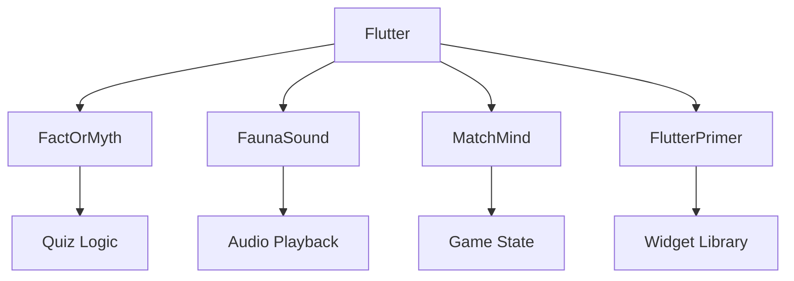

# 🧪 Flutter StarterLab - Project Suite

  
*A curated collection of production-ready Flutter templates demonstrating diverse capabilities*

## 🌟 Featured Projects

| Project | Description | Tech Highlights |
|---------|-------------|-----------------|
| [🔍 **FactOrMyth**](/FactOrMyth) | True/False Quiz Game | `State Management`, `Alert Dialogs` |
| [🐾 **FaunaSound**](/FaunaSound) | Animal Sound Explorer | `audioplayers`, `Asset Management` |
| [🧩 **MatchMind**](/MatchMind) | Memory Matching Game | `dart:math`, `Gesture Detection` |
| [🛠 **FlutterPrimer**](/FlutterPrimer) | Core Widgets Catalog | `Material Design`, `Layouts` |

## 🏗️ Architectural Overview

